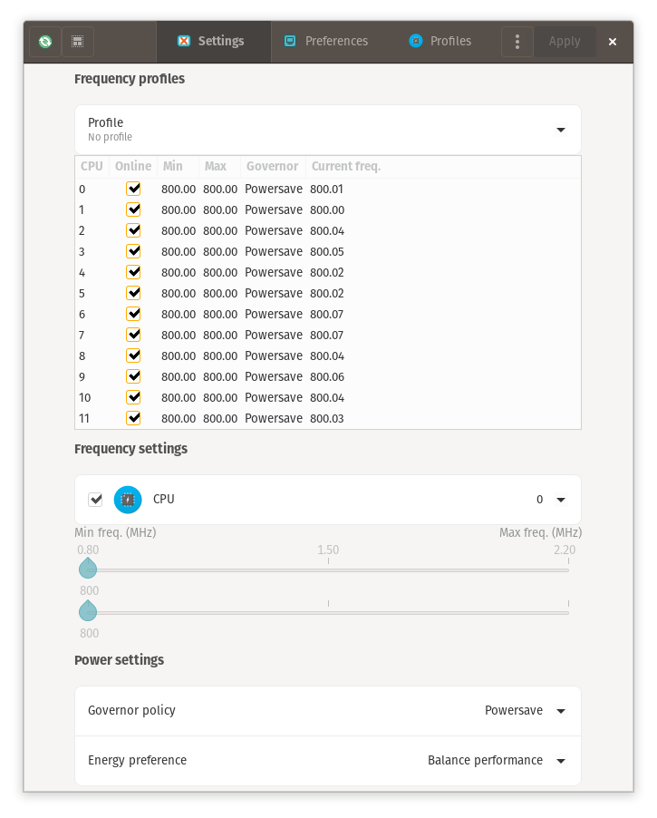

# Linux power optimization tutorial for Nvidia, Intel and Ubuntu based distributions

Optimizing power consumption for Linux/Unix system is not an easy tasks. We had very few contents about this theme, and few people available to discuss that. This tutorial is intended for users of nvidia/ubuntu based laptops.

1. **Know your hardware and powertop** - First step we need to do for start optimizing power in our system is know what hardware we are using. Intel based devices are easier to tune, because many of them have opensource implementations. Most devices have a power save mode, and unlike windows, in Linux/Unix system they aren't configured to save power by default. We need to get information about all devices and their power operations modes. Best tool I know to acquire this is powertop(by intel).
* **Powertop** - Powertop is a monitoring tool designed by intel to list all devices thats have power operation modes and tweak them. We can install powertop with the command line bolow:
  
  ```
  sudo apt install powertop
  ```

First step using powertop is to calibrate the readings on battery power with the command:

```
sudo powertop -c
```

It will take about 10 minutes to run the callibration. The system will turn the display on and off some times, and is not possible to do anything else during the process.
Powertop can be used by itself to see what is using resources on your system. It needs to be left open for a little amount of time to gather statistics, and be accurate.

```
powertop
```

We can also generate reports with powertop

```
sudo powertop --html=report.html
```

It's usefull see what running processes or applications are taking more power. You can uninstall them or change some settings to reduce power usage.


We can also tune the devices to save power mode. In report, there is a tab **Tuning**. You will find many suggestions to increase battery life.


In image below, in section **Tunables**, we can see all devices thats have power modes available for tweak. The **Bad** label show us what devices are operating in performance mode. We need to setup most of them to **Good** label, to acquire power save mode.


Some devices like usb controllers for mouses don't need to be put in save power mode, or we can experience some behaviors like mouse stoping to work for some time. We can enable or disable power save mode just hiting space key.

We can enable all suggested tunings running the command line:

```
sudo powertop --auto-tune
```

2. **Controlling CPU Frequency** - High cpu frequency means high power consumption. It maybe using less cpu power will be desireable to maintain a good cpu temperature and a silent machine. The application **cpupower-gui** can allow changes in cpu's frequency limits. Usage is very intuitive, and the application can be installed from github repository [here](https://github.com/vagnum08/cpupower-gui).



3. Changing CPU frequency using the command line interface - Its also possible do what cpupower-gui do with the command line interface.
* **We can query the cpu frequency attributes of a core**:

```
$ grep . /sys/devices/system/cpu/cpu0/cpufreq/*
/sys/devices/system/cpu/cpu0/cpufreq/affected_cpus:0
/sys/devices/system/cpu/cpu0/cpufreq/base_frequency:2200000
/sys/devices/system/cpu/cpu0/cpufreq/cpuinfo_max_freq:2200000
/sys/devices/system/cpu/cpu0/cpufreq/cpuinfo_min_freq:800000
/sys/devices/system/cpu/cpu0/cpufreq/cpuinfo_transition_latency:0
/sys/devices/system/cpu/cpu0/cpufreq/energy_performance_available_preferences:default performance balance_performance balance_power power 
/sys/devices/system/cpu/cpu0/cpufreq/energy_performance_preference:balance_performance
/sys/devices/system/cpu/cpu0/cpufreq/related_cpus:0
/sys/devices/system/cpu/cpu0/cpufreq/scaling_available_governors:performance powersave
/sys/devices/system/cpu/cpu0/cpufreq/scaling_cur_freq:800083
/sys/devices/system/cpu/cpu0/cpufreq/scaling_driver:intel_pstate
/sys/devices/system/cpu/cpu0/cpufreq/scaling_governor:powersave
/sys/devices/system/cpu/cpu0/cpufreq/scaling_max_freq:800000
/sys/devices/system/cpu/cpu0/cpufreq/scaling_min_freq:800000
/sys/devices/system/cpu/cpu0/cpufreq/scaling_setspeed:<unsupported>
```

* **Changing the cpu frequency scaling governor and checking it:**

```
echo powersave | sudo tee /sys/devices/system/cpu/cpu*/cpufreq/scaling_governor

grep . /sys/devices/system/cpu/cpu*/cpufreq/scaling_governor
/sys/devices/system/cpu/cpu0/cpufreq/scaling_governor:powersave
/sys/devices/system/cpu/cpu10/cpufreq/scaling_governor:powersave
/sys/devices/system/cpu/cpu11/cpufreq/scaling_governor:powersave
/sys/devices/system/cpu/cpu1/cpufreq/scaling_governor:powersave
/sys/devices/system/cpu/cpu2/cpufreq/scaling_governor:powersave
/sys/devices/system/cpu/cpu3/cpufreq/scaling_governor:powersave
/sys/devices/system/cpu/cpu4/cpufreq/scaling_governor:powersave
/sys/devices/system/cpu/cpu5/cpufreq/scaling_governor:powersave
/sys/devices/system/cpu/cpu6/cpufreq/scaling_governor:powersave
/sys/devices/system/cpu/cpu7/cpufreq/scaling_governor:powersave
/sys/devices/system/cpu/cpu8/cpufreq/scaling_governor:powersave
/sys/devices/system/cpu/cpu9/cpufreq/scaling_governor:powersave
```

* **Setting mac CPU frequency to a value and check it:**

```
echo 800000 | sudo tee /sys/devices/system/cpu/cpu*/cpufreq/scaling_max_freq
800000

/sys/devices/system/cpu/cpu0/cpufreq/scaling_max_freq:800000
/sys/devices/system/cpu/cpu10/cpufreq/scaling_max_freq:800000
/sys/devices/system/cpu/cpu11/cpufreq/scaling_max_freq:800000
/sys/devices/system/cpu/cpu1/cpufreq/scaling_max_freq:800000
/sys/devices/system/cpu/cpu2/cpufreq/scaling_max_freq:800000
/sys/devices/system/cpu/cpu3/cpufreq/scaling_max_freq:800000
/sys/devices/system/cpu/cpu4/cpufreq/scaling_max_freq:800000
/sys/devices/system/cpu/cpu5/cpufreq/scaling_max_freq:800000
/sys/devices/system/cpu/cpu6/cpufreq/scaling_max_freq:800000
/sys/devices/system/cpu/cpu7/cpufreq/scaling_max_freq:800000
/sys/devices/system/cpu/cpu8/cpufreq/scaling_max_freq:800000
/sys/devices/system/cpu/cpu9/cpufreq/scaling_max_freq:800000
```

* **Query if the frequency is limiting:**

```
grep . /sys/devices/system/cpu/cpu*/cpufreq/scaling_cur_freq

/sys/devices/system/cpu/cpu0/cpufreq/scaling_cur_freq:800778
/sys/devices/system/cpu/cpu10/cpufreq/scaling_cur_freq:800047
/sys/devices/system/cpu/cpu11/cpufreq/scaling_cur_freq:800099
/sys/devices/system/cpu/cpu1/cpufreq/scaling_cur_freq:800109
/sys/devices/system/cpu/cpu2/cpufreq/scaling_cur_freq:800064
/sys/devices/system/cpu/cpu3/cpufreq/scaling_cur_freq:801266
/sys/devices/system/cpu/cpu4/cpufreq/scaling_cur_freq:800118
/sys/devices/system/cpu/cpu5/cpufreq/scaling_cur_freq:800160
/sys/devices/system/cpu/cpu6/cpufreq/scaling_cur_freq:799999
/sys/devices/system/cpu/cpu7/cpufreq/scaling_cur_freq:800112
/sys/devices/system/cpu/cpu8/cpufreq/scaling_cur_freq:800117
/sys/devices/system/cpu/cpu9/cpufreq/scaling_cur_freq:800004
```

4. **Overheating, CPU/GPU monitoring, Fine Tuning** - Biggest vilains of pc overheating are cpus and gpus. If they are working in maximum performance every time, they will get at the threshold temperature soon, and the performance issues will begin happen. Overheating also leads to hardware damage, and its very important that our devices are operating in proper temperature.
* **Sensors tool** - We can use sensors tool to monitore our cpus temperature.
  To install sensors:

```
sudo apt install lm-sensors
```

```
$ sensors
coretemp-isa-0000
Adapter: ISA adapter
Package id 0:  +47.0°C  (high = +100.0°C, crit = +100.0°C)
Core 0:        +45.0°C  (high = +100.0°C, crit = +100.0°C)
Core 1:        +46.0°C  (high = +100.0°C, crit = +100.0°C)
Core 2:        +47.0°C  (high = +100.0°C, crit = +100.0°C)
Core 3:        +44.0°C  (high = +100.0°C, crit = +100.0°C)
Core 4:        +45.0°C  (high = +100.0°C, crit = +100.0°C)
Core 5:        +44.0°C  (high = +100.0°C, crit = +100.0°C)

BAT0-acpi-0
Adapter: ACPI interface
in0:          17.28 V  
curr1:       1000.00 uA 

pch_cannonlake-virtual-0
Adapter: Virtual device
temp1:        +44.0°C  

acpitz-acpi-0
Adapter: ACPI interface
temp1:        +25.0°C  (crit = +107.0°C)
```

Package Id 0 is the cores cpu temperature mean.

Psensors is a tool that works using sensors. Its a gui with charts:


**GPU/CPU temperatures higher than 85c leads to hardware damage**, and for years I searched for a way to reduce gpu work, but without success because the lack of documentation. Our eyes don't notice frame transitions at a speed higher than 24fps. Until 60fps, we can perceive a smooth change of quality in vídeo. Above 60fps there are no perception in quality overall. **For Nvidia users, we can config the card to use on demand mode, and setup Xorg to sync with monitor(60hz)**.


* **Nvidia Profile Configurarion for 60fps**


* **Nvidia Rule Configuration for 60fps** - Not Xorg, but all opengl/vulkan applications can run at 60fps using this rules


* **MangoHud and Games** - As 60fps cap for games and Xorg may be a good start, for some games it will require more optimizations. 60fps may be a lot of work for some games that aren't very well optimized, and, for Linux/Unix systems, I couldn't found a Nvidia key instruction to cap fps lower than 60. [MangoHud](https://github.com/flightlessmango/MangoHud) is a software that will help us to do this fine tuning.

For ubuntu base distros, we can use MangoHud ppa for installation

```
sudo add-apt-repository ppa:flexiondotorg/mangohud
sudo apt update
sudo apt install mangohud
```

We can cap fps using the command line

```
MANGOHUD_CONFIG=fps,fps_limit=30 mangohud --dlsym glxgears
```


We may also use it on steam. For this, just put the configuration on steam game launcher

```
__NV_PRIME_RENDER_OFFLOAD=1 __GLX_VENDOR_LIBRARY_NAME=nvidia mangohud --dlsym %command%
```

## Conslusion

I'm a long Linux/Unix system user, and always tryed to found a configurarion to optimize the system for a confortable use similar what we have in windows. Documentation for power usage and proprietary devices are hard to find. The last piece to found and be able to write this tutorial was mangohud. With all this configurarions we can have the very near or almost the same experience as we can in MS Windows systems, with low cpu load and acceptable gpu/cpu temperatures. 